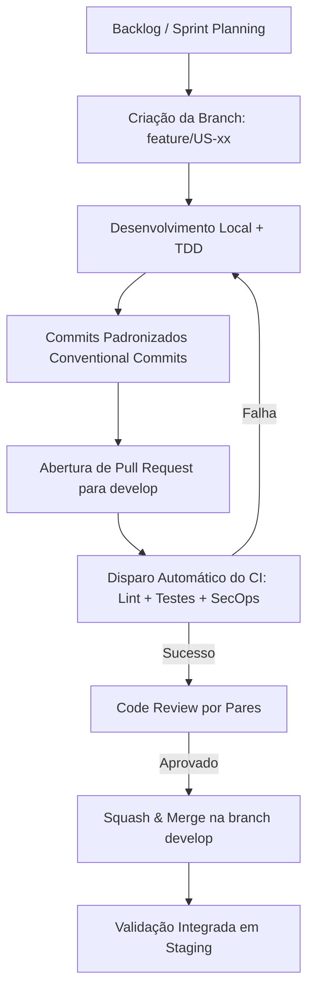
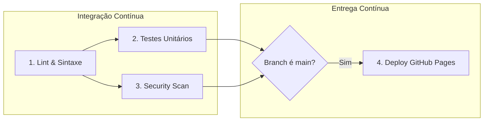

# 📘 Atividade 4 — Introdução ao DevOps
## Transformando a Ideia do SDASA em um Produto Digital Entregue Continuamente

**Curso:** Análise e Desenvolvimento de Sistemas — ADS  
**Disciplina:** Tópicos Avançados em Sistemas de Informação II  
**Orientação & Avaliação:** Prof.ª Erika Miranda (`eefmiranda@gmail.com`)  
**Sistema:** SDASA — Sistema Digital de Atendimento e Solicitações Acadêmicas  

---

### 👥 Papéis e Responsabilidades da Equipe no Modelo DevOps

| Integrante | Papel no Projeto | Atuação na Cultura DevOps |
|:---|:---|:---|
| **Prof.ª Erika Miranda** | *Product Owner & Docente Orientadora* | Validação de valor do negócio, aprovação de critérios de aceitação e aceite formal de entregas. |
| **Ana Beatriz Cruz da Silva** | *Scrum Master* | Facilitação ágil, remoção de impedimentos na esteira de entrega, gestão do fluxo no Kanban/Scrum. |
| **Donald Cintado Cabezas** | *Analista de Negócios* | Refinamento de User Stories, mapeamento de dores dos alunos/secretaria e regras de SLA. |
| **Stephanny Crepalde Costa** | *Arquiteta de Software* | Desenho arquitetural evolutivo, padrões de API, modularização de componentes e escalabilidade. |
| **Júlio César Benício Inácio** | *Dev & DevOps Engineer* | Construção e manutenção dos pipelines de CI/CD, governança de branches, scripts de automação e deploy. |
| **Maria Luiza Dias Silva Tavares** | *Security Officer (DevSecOps)* | Verificação contínua de vulnerabilidades (SAST/DAST), gestão de segredos e conformidade com a LGPD. |
| **Allan Vinícius Cabeggi Alvarenga** | *Analista de Qualidade (QA) e Sustentabilidade* | Planejamento e automação de testes (unitários, integração e usabilidade), métricas de eficiência de software. |

---

## 🎯 Pergunta Norteadora: Como transformaríamos nossa ideia em um produto digital entregue continuamente?

Para transformar o protótipo do **SDASA** em um produto digital vivo, estável e continuamente entregue aos alunos e funcionários, a equipe adota o **Ciclo Contínuo de DevOps**, integrando desenvolvimento, segurança e operações em uma esteira automatizada de feedback rápido:

```
    ┌─────────────┐       ┌──────────────┐       ┌─────────────┐
    │  1. PLANEJAR│ ───>  │  2. CODIFICAR│ ───>  │ 3. CONSTRUIR │
    │  (Backlog & │       │ (Git, Branch │       │   (Build &  │
    │   User St.) │       │  & Commits)  │       │   Linting)  │
    └─────────────┘       └──────────────┘       └─────────────┘
           ▲                                             │
           │                                             ▼
    ┌─────────────┐       ┌──────────────┐       ┌─────────────┐
    │8. MONITORAR │ <───  │ 7. IMPLANTAR │ <───  │  4. TESTAR  │
    │(Observab. & │       │(CD Automatiz.│       │ (Unitários &│
    │  Métricas)  │       │ GitHub Pages)│       │  Segurança) │
    └─────────────┘       └──────────────┘       └─────────────┘
```

A estratégia baseia-se em:
1. **Ciclos Curtos e Iterativos:** Quebra do escopo em incrementos pequenos com valor direto para as personas (Mariana, Carlos e Erika).
2. **Automação Integral (Shift-Left Testing & Security):** Testes e checagens de segurança executados a cada commit/PR antes que o código atinja qualquer ambiente compartilhado.
3. **Entrega Sem Intervenção Manual:** Cada aprovação na branch principal resulta em deploy automático no ambiente de produção com rastreabilidade total.
4. **Monitoramento Ativo:** Telemetria de erros em tempo real e controle estrito de prazos de atendimento (SLA).

---

## 1. 📁 Repositório Git e Governança Base

O repositório do SDASA foi arquitetado para garantir rastreabilidade, padronização e integridade:

- **Controle de Versão:** Git versão `2.53+` com branch principal `main`.
- **Hospedagem Remota:** GitHub, aproveitando a integração nativa com o **GitHub Actions**, **GitHub Pages**, **Issue Tracker** e **Branch Protection Rules**.
- **Arquivo `.gitignore`:** Configurado para ignorar dependências (`node_modules/`), arquivos de ambiente e segredos (`.env*`, `*.pem`), arquivos de compilação/distribuição (`dist/`, `build/`, `.cache/`), arquivos de sistema (`Thumbs.db`, `.DS_Store`) e configurações pessoais de editores (`.vscode/*`, exceto configurações compartilhadas do time).
- **Padronização de Projeto (`package.json`):** Gerenciador de comandos padronizado para execução unificada entre os membros da equipe:
  - `npm test`: Executa a bateria de testes unitários do core de regras de negócio.
  - `npm run lint`: Validação estática de sintaxe e integridade estrutural.

---

## 2. 🌳 Organização das Branches (Branching Model)

Adotamos uma abordagem híbrida moderna inspirada no **GitHub Flow** com elementos do **Gitflow**, ideal para equipes ágeis com entrega frequente:

```
[main]       ●───────────────────●───────────────────● (Deploy Produção: v1.0.0)
             │                   ▲                   ▲
             │                   │ Merge PR          │ Hotfix PR
[develop]    ●───────●───────────┼───────────────────┘
             │       ▲           │
             │       │ Merge PR  │
[feature/*]  └───────●───────────┘
```

### 2.1 Classificação das Branches: Permanentes vs. Transitórias (Sob Demanda)

Em alinhamento rigoroso com as melhores práticas de Engenharia de Software e governança Git, as branches são divididas em duas categorias operacionais:

#### A) Branches Permanentes (Long-Lived — Existem Fixamente no GitHub)
- **`main`**: Código de produção homologado e auditado. Protegida contra push direto. A cada merge aprovado nesta branch, o pipeline de CD implanta automaticamente a aplicação no GitHub Pages com tag SemVer.
- **`develop`**: Branch oficial de integração contínua da equipe. Centraliza o trabalho integrado de todos os desenvolvedores antes do corte de release para produção.

#### B) Branches Transitórias / Efêmeras (Short-Lived — Criadas Sob Demanda e Excluídas Após Merge)
> [!IMPORTANT]
> As branches com prefixos `feature/*`, `bugfix/*`, `hotfix/*` e `release/*` **não são branches estáticas permanentes**. Elas possuem ciclo de vida curto: são criadas a partir de `develop` (ou `main` no caso de hotfix), recebem commits com Conventional Commits e, assim que o Pull Request é aprovado e o merge é concluído, **são deletadas automaticamente** para evitar o acúmulo de branches órfãs e desatualizadas (*Branch Rot*).

| Categoria | Nome / Padrão | Origem | Destino (Merge) | Ciclo de Vida & Propósito |
|:---|:---|:---|:---|:---|
| **Permanente** | `main` | - | - | Produção estável e deploy contínuo (GitHub Pages). |
| **Permanente** | `develop` | `main` | `main` | Integração contínua e homologação de features. |
| **Transitória** | `feature/<card-id>-<slug>` | `develop` | `develop` | Criada para um card do backlog e deletada após merge. |
| **Transitória** | `bugfix/<card-id>-<slug>` | `develop` | `develop` | Criada para correção em homologação e deletada após merge. |
| **Transitória** | `hotfix/<slug>` | `main` | `main` e `develop` | Criada emergencialmente para produção e deletada após merge. |
| **Transitória** | `release/vX.Y.Z` | `develop` | `main` e `develop` | Criada temporariamente para corte de versão formal. |

### 2.2 Estado Atual das Branches no Repositório Remoto (GitHub)

Para que a avaliação da docente (**Prof.ª Erika Miranda**) possa verificar a esteira em tempo real no GitHub, o repositório remoto conta com as seguintes branches ativas:

1. **`main`**: Branch principal com o código base auditado, histórico linear e tag `v1.0.0`.
2. **`develop`**: Branch de homologação ativa sincronizada com o time de desenvolvimento.
3. **`feature/US-02-catalogo-solicitacoes`**: Branch de funcionalidade ativa demonstrando na prática o isolamento de trabalho referente à User Story US-02 (Catálogo com indicação de SLA) antes da submissão de Pull Request.

### 2.3 Políticas de Proteção de Branches (Branch Protection Rules)

Para salvaguardar a integridade das branches `main` e `develop`:
1. **Proibição de Push Direto (`Direct Push Blocked`):** Nenhum integrante da equipe pode fazer `git push` direto nas branches protegidas.
2. **Revisão Obrigatória por Pares (Pull Request):** Todo merge exige no mínimo 1 aprovação formal de outro desenvolvedor ou arquiteto (Stephanny ou Júlio).
3. **Status Checks Obrigatórios:** O pipeline de CI (`lint-and-validate`, `unit-tests`, `security-scan`) deve passar com 100% de sucesso antes da liberação do botão de merge.
4. **Histórico Linear (`Squash and Merge` ou `Rebase`):** As branches de funcionalidade são consolidadas para manter um histórico limpo e auditável na branch principal.

---

## 3. ✍️ Estratégia de Commits (Conventional Commits 1.0.0)

A equipe adota estritamente o padrão **Conventional Commits** para assegurar que todo o histórico seja legível por humanos e automatizável por ferramentas de changelog.

### 3.1 Estrutura do Commit

```text
<tipo>(<escopo opcional>): <descrição sucinta no tempo presente imperativo>

[corpo detalhado explicando o motivo da mudança, se necessário]

[rodapé com referências a issues ou breaking changes]
```

### 3.2 Tabela de Tipos Permitidos

| Prefixo | Significado | Exemplo no Contexto SDASA |
|:---|:---|:---|
| `feat` | Nova funcionalidade para o usuário | `feat(solicitacoes): adicionar upload de atestados medicos em PDF` |
| `fix` | Correção de defeito / bug | `fix(sla): corrigir calculo de dias uteis para justificativa de faltas` |
| `docs` | Alterações puramente em documentação | `docs(readme): detalhar instrucoes de configuracao do ambiente local` |
| `style` | Formatação e estilo sem alteração de lógica | `style(dashboard): ajustar espacamento e alinhamento dos cards de metricas` |
| `refactor` | Refatoração de código sem mudar comportamento | `refactor(auth): modularizar validacao de perfis e permissoes RBAC` |
| `test` | Adição ou correção de testes automatizados | `test(protocolo): cobrir geracao de codigo unico SDASA-2026-XXXX` |
| `ci` | Modificações em scripts e pipelines de CI/CD | `ci(github-actions): adicionar step de auditoria de segredos no workflow` |
| `chore` | Manutenção de tarefas cotidianas e dependências | `chore(npm): atualizar scripts de teste e linting no package.json` |
| `security` | Ajustes específicos de segurança e privacidade | `security(lgpd): aplicar mascara nos digitos intermediarios de CPF` |

---

## 4. 📋 Backlog Inicial Estruturado

Com base nas dores mapeadas no projeto SDASA, dividimos o backlog em **4 Épicos Fundamentais** e selecionamos **8 User Stories** de alta relevância para a primeira entrega:

### 4.1 Épicos do Produto
- **ÉPICO 01: Identidade, Acesso e Perfis** — Gestão de login, autenticação segura e diferenciação de visões (Aluno, Secretaria e Docente).
- **ÉPICO 02: Catálogo de Serviços e Abertura de Solicitações** — Catálogo parametrizado, formulários intuitivos, upload de anexos e cálculo de SLA.
- **ÉPICO 03: Gestão de Atendimento, Triagem e Despacho** — Painel da secretaria, alteração de status, histórico e linha do tempo.
- **ÉPICO 04: Transparência, Notificações e Segurança** — Notificações em tempo real, geração de comprovante oficial e conformidade LGPD.

### 4.2 Tabela de User Stories Detalhadas

| ID | Épico | Título da História de Usuário | Prioridade (MoSCoW) | Estimativa (SP) |
|:---:|:---:|:---|:---:|:---:|
| **US-01** | Épico 01 | Autenticação Unificada por E-mail Institucional ou CPF | **Must Have** | 3 SP |
| **US-02** | Épico 02 | Seleção de Serviços Acadêmicos com Indicação Clara de SLA | **Must Have** | 5 SP |
| **US-03** | Épico 02 | Abertura de Solicitação com Upload de Documentos Comprobatórios | **Must Have** | 5 SP |
| **US-04** | Épico 02 | Geração Dinâmica de Protocolo Oficial e Comprovante de Envio | **Must Have** | 3 SP |
| **US-05** | Épico 03 | Painel de Controle de Solicitações para Secretaria (Triagem e Despacho) | **Must Have** | 8 SP |
| **US-06** | Épico 03 | Linha do Tempo Visual do Ciclo de Vida do Pedido | **Should Have** | 5 SP |
| **US-07** | Épico 04 | Notificações no Sistema e Feedback de Alteração de Status | **Should Have** | 3 SP |
| **US-08** | Épico 04 | Anonimização e Conformidade LGPD de Dados Sensíveis do Aluno | **Must Have** | 5 SP |

---

### 4.3 Detalhamento das Histórias (Formato Ágil + Critérios Gherkin)

#### 🔹 US-01: Autenticação Unificada por E-mail Institucional ou CPF
- **Como:** Estudante (Mariana) ou funcionário acadêmico (Carlos/Erika)
- **Quero:** Acessar a plataforma informando meu e-mail institucional ou CPF com senha segura
- **Para que:** Eu possa acessar meus serviços acadêmicos de forma rápida e protegida.
- **Critérios de Aceitação (Gherkin):**
  ```gherkin
  Cenário: Login com credenciais válidas
    Dado que estou na tela de login
    Quando informo o e-mail "mariana.oliveira@faculdade.edu.br" e a senha correta
    Então o sistema deve me redirecionar para o Dashboard do Estudante com meus dados carregados.

  Cenário: Tentativa com credenciais inválidas
    Dado que estou na tela de login
    Quando informo uma senha incorreta
    Então o sistema deve exibir alerta "Credenciais inválidas" sem revelar se o e-mail existe.
  ```

#### 🔹 US-02: Seleção de Serviços Acadêmicos com Indicação Clara de SLA
- **Como:** Estudante universitário
- **Quero:** Visualizar um catálogo claro de tipos de solicitações com o prazo estimado de resposta
- **Para que:** Eu saiba antecipadamente quanto tempo levará para meu requerimento ser concluído.
- **Critérios de Aceitação (Gherkin):**
  ```gherkin
  Cenário: Exibição correta do prazo de atendimento
    Dado que acesso a tela de "Nova Solicitação"
    Quando visualizo o card "Declaração de Matrícula"
    Então o sistema deve exibir a informação de prazo "até 1 dia útil"
    E a lista de documentos necessários deve informar "Nenhum documento adicional obrigatório".
  ```

#### 🔹 US-03: Abertura de Solicitação com Upload de Documentos Comprobatórios
- **Como:** Estudante (Mariana)
- **Quero:** Anexar arquivos (PDF, JPG, PNG) ao justificar faltas ou solicitar dispensa de disciplinas
- **Para que:** A secretaria tenha as evidências necessárias para validar meu requerimento sem retrabalho.
- **Critérios de Aceitação (Gherkin):**
  ```gherkin
  Cenário: Upload de documento válido
    Dado que selecionei o serviço "Envio de Atestado Médico"
    Quando seleciono um arquivo PDF com menos de 5MB
    Então o arquivo deve ser listado com nome legível e opção de remoção antes do envio.

  Cenário: Bloqueio de submissão sem preenchimento da descrição
    Dado que selecionei um serviço mas deixei o campo de descrição em branco
    Quando clico no botão "Enviar Solicitação"
    Então o sistema bloqueia o envio e avisa "Por favor, descreva detalhadamente a sua solicitação".
  ```

#### 🔹 US-04: Geração Dinâmica de Protocolo Oficial e Comprovante de Envio
- **Como:** Estudante (Mariana)
- **Quero:** Receber imediatamente após o envio um número oficial de protocolo no formato `#SDASA-2026-XXXX`
- **Para que:** Eu tenha valor legal e comprobatório de que submeti meu pedido dentro do prazo acadêmico.
- **Critérios de Aceitação (Gherkin):**
  ```gherkin
  Cenário: Sucesso na geração de protocolo
    Dado que enviei com sucesso uma solicitação
    Quando sou direcionado para a tela de confirmação
    Então o protocolo exibido deve obedecer à máscara "SDASA-2026-[0-9]{4}"
    E a data limite de conclusão calculada deve corresponder à data atual somada ao SLA do serviço.
  ```

#### 🔹 US-05: Painel de Controle de Solicitações para Secretaria (Triagem e Despacho)
- **Como:** Analista da Secretaria Acadêmica (Carlos Eduardo)
- **Quero:** Filtrar todas as solicitações pendentes por status e despachar com parecer formal
- **Para que:** A secretaria mantenha os prazos de atendimento (SLA) sob estrito controle operacional.
- **Critérios de Aceitação (Gherkin):**
  ```gherkin
  Cenário: Despacho e alteração de status
    Dado que estou logado como perfil Secretaria
    Quando abro a modal de despacho da solicitação "#SDASA-2026-1042"
    E seleciono o status "Deferido" preenchendo o parecer "Documento emitido com sucesso"
    Então a solicitação deve ter seu status atualizado para "approved"
    E uma notificação deve ser gerada automaticamente para a aluna Mariana.
  ```

#### 🔹 US-06: Linha do Tempo Visual do Ciclo de Vida do Pedido
- **Como:** Estudante ou funcionário da secretaria
- **Quero:** Consultar o histórico completo de etapas percorridas por uma solicitação
- **Para que:** Haja transparência de quem executou cada ação e em que momento.
- **Critérios de Aceitação (Gherkin):**
  ```gherkin
  Cenário: Visualização de histórico
    Dado que clico no botão "Detalhes" de uma solicitação ativa
    Quando a modal de detalhes se abre
    Então deve ser exibida a linha do tempo com: Data de Abertura, Triagem, Análise e Parecer Final.
  ```

#### 🔹 US-07: Notificações no Sistema e Feedback de Alteração de Status
- **Como:** Estudante (Mariana)
- **Quero:** Receber alertas na central de notificações sempre que meu pedido mudar de status
- **Para que:** Eu não precise ir até a faculdade ou mandar e-mails cobrando resposta.
- **Critérios de Aceitação (Gherkin):**
  ```gherkin
  Cenário: Notificação de conclusão de pedido
    Dado que o status da solicitação da aluna Mariana foi alterado para "approved"
    Quando a aluna abre a aplicação
    Então o sino de notificações deve indicar um novo item não lido informando o deferimento.
  ```

#### 🔹 US-08: Anonimização e Conformidade LGPD de Dados Sensíveis
- **Como:** Encarregada de Segurança e Privacidade (Maria Luiza)
- **Quero:** Que o CPF e dados de contato do aluno sejam mascarados nas visualizações gerais
- **Para que:** O SDASA atenda integralmente à Lei Geral de Proteção de Dados (Lei nº 13.709/2018).
- **Critérios de Aceitação (Gherkin):**
  ```gherkin
  Cenário: Mascaramento de CPF em listagens públicas
    Dado que uma listagem exibe dados de cadastro de usuários
    Quando o CPF do aluno é renderizado
    Então os dígitos centrais devem ser ocultados (ex: "123.***.***-00").
  ```

---

### 4.4 Definições Formais de Governança Ágil (DoR e DoD)

#### 📝 Definition of Ready (DoR) — Quando uma história pode entrar na Sprint:
1. A User Story possui o formato padrão (*Como / Quero / Para que*).
2. Os Critérios de Aceitação estão redigidos em formato Gherkin e foram aprovados pela PO (Prof.ª Erika).
3. As dependências técnicas foram validadas pela Arquiteta (Stephanny).
4. A estimativa em Story Points foi acordada por consenso na Sprint Planning (Ana Beatriz).
5. O impacto em segurança da informação e LGPD foi pré-avaliado (Maria Luiza).

#### ✅ Definition of Done (DoD) — Quando uma história pode ser considerada pronta:
1. O código foi desenvolvido e atende a 100% dos critérios de aceitação.
2. Não há erros no console do navegador nem falhas de lint estático.
3. Testes unitários foram implementados e executam com 100% de sucesso (`npm test`).
4. O código foi revisado por pelo menos um colega via Pull Request (Peer Review).
5. O pipeline de CI/CD foi executado no GitHub Actions com status **Success (Verde)**.
6. A funcionalidade foi validada no ambiente de homologação (`develop`) ou demonstrada ao PO.

---

## 5. 🔄 Processo de Desenvolvimento

O fluxo de trabalho estabelece uma esteira repetível, transparente e segura:



### 5.1 Boas Práticas Adotadas
- **Shift-Left Security:** Análise de vulnerabilidades desde as primeiras linhas de código. Nenhum token, senha ou chave pode entrar no histórico do Git.
- **Pair Programming:** Sessões de pareamento entre Júlio (DevOps) e Allan (QA) para garantir testabilidade imediata.
- **Templates Padronizados:** Uso obrigatório de templates para novas Issues (`.github/ISSUE_TEMPLATE/`) e Pull Requests (`.github/PULL_REQUEST_TEMPLATE.md`).

---

## 6. 🧪 Processo de Testes (Estratégia de QA — Allan Vinícius)

A estratégia de testes do SDASA adota o modelo clássico da **Pirâmide de Testes**, garantindo maior cobertura na base (mais rápida e barata) e validações criteriosas no topo:

```
                  / \
                 /E2E\      -> Teste de Usabilidade (8 Etapas do Widget)
                /-----\
               / INTEG \    -> Fluxo de Submissão e Persistência
              /---------\
             / UNITÁRIOS \  -> Protocolo, Cálculo de SLA, Permissões RBAC
            /-------------\
           /   ESTÁTICOS   \ -> Linting, Sintaxe JS e Integridade de Arquivos
          /-----------------\
```

### 6.1 Níveis de Teste Implementados

1. **Testes Estáticos (Lint & Syntax):**
   - Validação da árvore de sintaxe abstrata dos arquivos JavaScript (`node -c js/app.js`, `node -c js/mock-data.js`).
   - Verificação da integridade do HTML5 e das folhas de estilo CSS.

2. **Testes Unitários Automatizados (Core de Negócio):**
   - Implementados no arquivo `tests/sdasa-core.test.js` e executados via **Node.js Test Runner nativo** (`npm test`).
   - **Cenários Cobertos:**
     - Validação de máscara do Protocolo Oficial (`SDASA-2026-\d{4}`).
     - Validação do catálogo de serviços e parametrização correta de SLA (7 serviços).
     - Cálculo determinístico da data limite de conclusão com base no SLA do serviço.
     - Controle de Acesso Baseado em Papéis (RBAC): garantia de que alunos não despacham pedidos e que a secretaria possui acesso privilegiado.
     - Validação de transições de status lícitas e proibição de reabertura arbitrária a partir de estados finais (`completed` / `rejected`).
     - Verificação das 8 etapas obrigatórias do Roteiro de Usabilidade.

3. **Testes de Integração e Usabilidade (Roteiro da Seção 5.5):**
   - Validação dos 8 passos interativos através do widget flutuante:
     1. Acesso à tela inicial.
     2. Login da persona (Mariana Oliveira).
     3. Localização do botão "Nova Solicitação".
     4. Seleção de serviço parametrizado.
     5. Preenchimento de justificativa e anexos.
     6. Submissão formal da requisição.
     7. Verificação do protocolo e prazo estimado.
     8. Acompanhamento no histórico e notificação de status.

4. **Testes de Segurança (SecOps — Maria Luiza):**
   - Varredura automatizada no CI contra presença inadvertida de chaves privadas (`BEGIN PRIVATE KEY`) e arquivos `.env` versionados.

---

## 7. 🚀 Processo de Entrega Contínua (CI/CD — Júlio César)

A esteira de integração e entrega contínua está implementada no arquivo `.github/workflows/ci-cd.yml` e divide-se em 4 estágios essenciais:



### 7.1 Detalhamento dos Jobs do Pipeline

1. **Job 1: Análise Estática & Lint (`lint-and-validate`):**
   - Faz checkout do código, prepara o ambiente Node.js 20.x e valida a sintaxe dos arquivos JS e a integridade de `index.html` e `style.css`.
2. **Job 2: Testes Unitários (`unit-tests`):**
   - Depende do sucesso do Job 1. Dispara `npm test`, validando que todas as regras de negócio críticas do SDASA continuam íntegras.
3. **Job 3: Verificação de Segurança (`security-scan`):**
   - Executa varredura de credenciais e segredos em paralelo com os testes unitários.
4. **Job 4: Deploy Contínuo (`deploy`):**
   - Gatilho exclusivo: commits/merges na branch `main`.
   - Realiza o empacotamento do frontend estático e publica automaticamente no **GitHub Pages**, disponibilizando o protótipo imediatamente em uma URL HTTPS pública.

### 7.2 Versionamento Semântico e Releases
- A equipe utiliza **Semantic Versioning (SemVer 2.0.0)** no formato `vMAJOR.MINOR.PATCH`:
  - `v1.0.0`: Versão inicial estável correspondente ao encerramento do Módulo 1 (Atividade 4).
  - Git Tags geradas a cada release final aprovada pela orientadora.

---

## 8. 📊 Processo de Monitoramento e Observabilidade

Uma vez em produção, o produto é acompanhado continuamente para antecipar falhas e aferir a satisfação dos usuários acadêmicos:

### 8.1 Os Quatro Sinais Dourados (Google SRE) aplicados ao SDASA

| Sinal Dourado | Definição no SDASA | Métrica Alvo (SLO) | Ferramenta / Ação |
|:---|:---|:---|:---|
| **Latência** | Tempo de renderização das telas e resposta às interações do usuário | < 800ms para carregamento inicial | Lighthouse CI & Web Vitals |
| **Tráfego** | Quantidade de estudantes e funcionários ativos simultaneamente | Suportar picos em semanas de matrícula e provas | Google Analytics 4 / Cloudflare |
| **Erros** | Exceções de script no navegador ou falhas de submissão | Taxa de erro < 0.1% das sessões | Sentry Browser SDK |
| **Saturação** | Limite de conexões e volume de armazenamento de anexos | Alertas disparados ao atingir 80% da capacidade | Monitoramento de storage em nuvem |

### 8.2 Monitoramento de Disponibilidade e Notificação de Incidentes
- **Uptime Monitoring:** Configuração de monitoramento contínuo via **UptimeRobot** verificando a URL do GitHub Pages a cada 60 segundos com envio de alertas automáticos.
- **Canal de Alertas:** Integração via Webhook com o canal de comunicação da equipe no Discord/Slack para notificação imediata de qualquer quebra de build no CI ou falha de disponibilidade.
- **Métricas de Negócio:**
  - Taxa de cumprimento de SLA (% de solicitações atendidas dentro do prazo estipulado).
  - Volume diário de abertura por tipo de serviço acadêmico (identificando gargalos na secretaria).
- **Cultura de Blameless Post-Mortem:** Sempre que um incidente ocorrer em produção, a equipe se reúne sob facilitação da Scrum Master (Ana Beatriz) para documentar: causa raiz, tempo de detecção, impacto e plano de ação preventivo, sem culpabilização individual.

---

## 9. 📬 Entregável e Instruções de Acesso para a Docente

Conforme solicitado nas instruções da atividade, o repositório Git deve ser disponibilizado com acesso para a docente orientadora:

- **E-mail de Acesso:** `eefmiranda@gmail.com`
- **Link do Repositório:** A ser compartilhado no envio da atividade acadêmica no formato:  
  `https://github.com/<seu-usuario-github>/SDASA`

### Passo a Passo para Subir o Repositório no GitHub e Adicionar a Professora:

1. **Subir o Repositório Local para o GitHub:**
   ```bash
   # Criar o repositório no GitHub (via interface web ou GitHub CLI: gh repo create SDASA --public)
   # Em seguida, vincular e enviar os branches locais:
   git remote add origin https://github.com/<seu-usuario-github>/SDASA.git
   git push -u origin main
   git push -u origin develop
   ```

2. **Convidar a Docente no Repositório (se for privado ou para dar permissão de colaboradora):**
   - Acesse o repositório no GitHub: `https://github.com/<seu-usuario-github>/SDASA`.
   - Clique na aba **Settings** (Configurações).
   - No menu lateral esquerdo, clique em **Collaborators** (Colaboradores).
   - Clique no botão verde **Add people** (Adicionar pessoas).
   - Digite o e-mail: `eefmiranda@gmail.com`.
   - Selecione o usuário correspondente e confirme o envio do convite.

3. **Habilitar o GitHub Pages (Ambiente de Produção do CD):**
   - Ainda em **Settings**, vá até a seção **Pages** (no menu lateral).
   - Em **Build and deployment > Source**, selecione **GitHub Actions**.
   - A partir deste momento, a esteira do `.github/workflows/ci-cd.yml` publicará automaticamente o SDASA a cada push na `main`.
