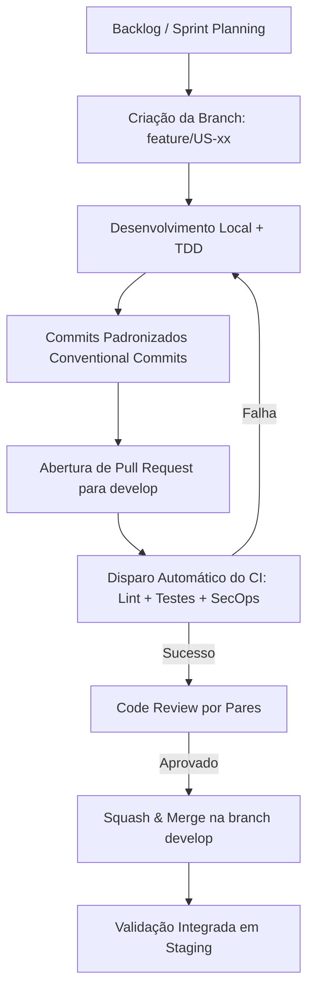
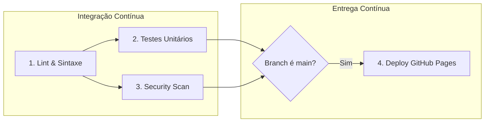

# 📘 Atividade 4 — Introdução ao DevOps
## Transformando a Ideia do SDASA em um Produto Digital Entregue Continuamente

**Curso:** Análise e Desenvolvimento de Sistemas — ADS  
**Disciplina:** Tópicos Avançados em Sistemas de Informação II  
**Orientação & Avaliação:** Prof.ª Erika Miranda (`eefmiranda@gmail.com`)  
**Sistema:** SDASA — Sistema Digital de Atendimento e Solicitações Acadêmicas  

---

### 👥 Papéis e Responsabilidades da Equipe no Modelo DevOps (Conforme Seção 6.15)

| Integrante | Papel no Módulo 1 | Atuação na Cultura DevOps |
|:---|:---|:---|
| **Prof.ª Erika Miranda** | *Product Owner* | Priorização das necessidades e do backlog. |
| **Donald Cintado Cabezas** | *Scrum Master* | Organização do trabalho e facilitação da comunicação. |
| **Ana Beatriz Cruz da Silva** | *Analista de Negócios* | Alinhamento da solução aos objetivos e indicadores. |
| **Maria Luiza Dias Silva Tavares** | *Arquiteto de Software* | Decisões arquiteturais e técnicas. |
| **Allan Vinícius Cabeggi Alvarenga** | *Dev/DevOps* | Desenvolvimento, versionamento, automação, Git e testes. |
| **Stephanny Crepalde Costa** | *Security Officer* | Segurança, riscos e proteção das informações. |
| **Júlio César Benício Inácio** | *Analista de Qualidade e Sustentabilidade* | Qualidade, testes e práticas de sustentabilidade. |

---

## 🎯 Pergunta Norteadora: Como transformaríamos nossa ideia em um produto digital entregue continuamente?

Para transformar o protótipo do **SDASA** em um produto digital vivo, estável e continuamente entregue aos alunos e funcionários, a equipe adota o **Ciclo Contínuo de DevOps**, integrando desenvolvimento, segurança e operações em uma esteira automatizada de feedback rápido:

```
    ┌─────────────┐       ┌──────────────┐       ┌─────────────┐
    │  1. PLANEJAR│ ───>  │  2. CODIFICAR│ ───>  │ 3. CONSTRUIR │
    │  (Backlog & │       │ (Git, Branch │       │   (Build &  │
    │   User St.) │       │  & Commits)  │       │   Linting)  │
    └─────────────┘       └──────────────┘       └─────────────┘
           ▲                                             │
           │                                             ▼
    ┌─────────────┐       ┌──────────────┐       ┌─────────────┐
    │8. MONITORAR │ <───  │ 7. IMPLANTAR │ <───  │  4. TESTAR  │
    │(Observab. & │       │(CD Automatiz.│       │ (Unitários &│
    │  Métricas)  │       │ GitHub Pages)│       │  Segurança) │
    └─────────────┘       └──────────────┘       └─────────────┘
```

A estratégia baseia-se em:
1. **Ciclos Curtos e Iterativos:** Quebra do escopo em incrementos pequenos com valor direto para as personas (Mariana, Carlos e Erika).
2. **Automação Integral (Shift-Left Testing & Security):** Testes e checagens de segurança executados a cada commit/PR antes que o código atinja qualquer ambiente compartilhado.
3. **Entrega Sem Intervenção Manual:** Cada aprovação na branch principal resulta em deploy automático no ambiente de produção com rastreabilidade total.
4. **Monitoramento Ativo:** Telemetria de erros em tempo real e controle estrito de prazos de atendimento (SLA).

---

## 1. 📁 Repositório Git e Governança Base

O repositório do SDASA foi arquitetado para garantir rastreabilidade, padronização e integridade:

- **Controle de Versão:** Git versão `2.53+` com branch principal `main`.
- **Hospedagem Remota:** GitHub, aproveitando a integração nativa com o **GitHub Actions**, **GitHub Pages**, **Issue Tracker** e **Branch Protection Rules**.
- **Arquivo `.gitignore`:** Configurado para ignorar dependências (`node_modules/`), arquivos de ambiente e segredos (`.env*`, `*.pem`), arquivos de compilação/distribuição (`dist/`, `build/`, `.cache/`), arquivos de sistema (`Thumbs.db`, `.DS_Store`) e configurações pessoais de editores (`.vscode/*`, exceto configurações compartilhadas do time).
- **Padronização de Projeto (`package.json`):** Gerenciador de comandos padronizado para execução unificada entre os membros da equipe:
  - `npm test`: Executa a bateria de testes unitários do core de regras de negócio.
  - `npm run lint`: Validação estática de sintaxe e integridade estrutural.

---

## 2. 🌳 Organização das Branches (Branching Model)

Adotamos uma abordagem híbrida moderna inspirada no **GitHub Flow** com elementos do **Gitflow**, ideal para equipes ágeis com entrega frequente:

```
[main]       ●───────────────────●───────────────────● (Deploy Produção: v1.0.0)
             │                   ▲                   ▲
             │                   │ Merge PR          │ Hotfix PR
[develop]    ●───────●───────────┼───────────────────┘
             │       ▲           │
             │       │ Merge PR  │
[feature/*]  └───────●───────────┘
```

### 2.1 Classificação das Branches: Permanentes vs. Transitórias (Sob Demanda)

Em alinhamento rigoroso com as melhores práticas de Engenharia de Software e governança Git, as branches são divididas em duas categorias operacionais:

#### A) Branches Permanentes (Long-Lived — Existem Fixamente no GitHub)
- **`main`**: Código de produção homologado e auditado. Protegida contra push direto. A cada merge aprovado nesta branch, o pipeline de CD implanta automaticamente a aplicação no GitHub Pages com tag SemVer.
- **`develop`**: Branch oficial de integração contínua da equipe. Centraliza o trabalho integrado de todos os desenvolvedores antes do corte de release para produção.

#### B) Branches Transitórias / Efêmeras (Short-Lived — Criadas Sob Demanda e Excluídas Após Merge)
> [!IMPORTANT]
> As branches com prefixos `feature/*`, `bugfix/*`, `hotfix/*` e `release/*` **não são branches estáticas permanentes**. Elas possuem ciclo de vida curto: são criadas a partir de `develop` (ou `main` no caso de hotfix), recebem commits com Conventional Commits e, assim que o Pull Request é aprovado e o merge é concluído, **são deletadas automaticamente** para evitar o acúmulo de branches órfãs e desatualizadas (*Branch Rot*).

| Categoria | Nome / Padrão | Origem | Destino (Merge) | Ciclo de Vida & Propósito |
|:---|:---|:---|:---|:---|
| **Permanente** | `main` | - | - | Produção estável e deploy contínuo (GitHub Pages). |
| **Permanente** | `develop` | `main` | `main` | Integração contínua e homologação de features. |
| **Transitória** | `feature/<card-id>-<slug>` | `develop` | `develop` | Criada para um card do backlog e deletada após merge. |
| **Transitória** | `bugfix/<card-id>-<slug>` | `develop` | `develop` | Criada para correção em homologação e deletada após merge. |
| **Transitória** | `hotfix/<slug>` | `main` | `main` e `develop` | Criada emergencialmente para produção e deletada após merge. |
| **Transitória** | `release/vX.Y.Z` | `develop` | `main` e `develop` | Criada temporariamente para corte de versão formal. |

### 2.2 Estado Atual das Branches no Repositório Remoto (GitHub)

Para que a avaliação da docente (**Prof.ª Erika Miranda**) possa verificar a esteira em tempo real no GitHub, o repositório remoto conta com as seguintes branches ativas:

1. **`main`**: Branch principal com o código base auditado, histórico linear e tag `v1.0.0`.
2. **`develop`**: Branch de homologação ativa sincronizada com o time de desenvolvimento.
3. **`feature/US-02-catalogo-solicitacoes`**: Branch de funcionalidade ativa demonstrando na prática o isolamento de trabalho referente à User Story US-02 (Catálogo com indicação de SLA) antes da submissão de Pull Request.

### 2.3 Políticas de Proteção de Branches (Branch Protection Rules)

Para salvaguardar a integridade das branches `main` e `develop`:
1. **Proibição de Push Direto (`Direct Push Blocked`):** Nenhum integrante da equipe pode fazer `git push` direto nas branches protegidas.
2. **Revisão Obrigatória por Pares (Pull Request):** Todo merge exige no mínimo 1 aprovação formal de outro desenvolvedor ou arquiteto (Maria Luiza ou Allan).
3. **Status Checks Obrigatórios:** O pipeline de CI (`lint-and-validate`, `unit-tests`, `security-scan`) deve passar com 100% de sucesso antes da liberação do botão de merge.
4. **Histórico Linear (`Squash and Merge` ou `Rebase`):** As branches de funcionalidade são consolidadas para manter um histórico limpo e auditável na branch principal.

---

## 3. ✍️ Estratégia de Commits (Conventional Commits 1.0.0)

A equipe adota estritamente o padrão **Conventional Commits** para assegurar que todo o histórico seja legível por humanos e automatizável por ferramentas de changelog.

### 3.1 Estrutura do Commit

```text
<tipo>(<escopo opcional>): <descrição sucinta no tempo presente imperativo>

[corpo detalhado explicando o motivo da mudança, se necessário]

[rodapé com referências a issues ou breaking changes]
```

### 3.2 Tabela de Tipos Permitidos

| Prefixo | Significado | Exemplo no Contexto SDASA |
|:---|:---|:---|
| `feat` | Nova funcionalidade para o usuário | `feat(solicitacoes): adicionar upload de atestados medicos em PDF` |
| `fix` | Correção de defeito / bug | `fix(sla): corrigir calculo de dias uteis para justificativa de faltas` |
| `docs` | Alterações puramente em documentação | `docs(readme): detalhar instrucoes de configuracao do ambiente local` |
| `style` | Formatação e estilo sem alteração de lógica | `style(dashboard): ajustar espacamento e alinhamento dos cards de metricas` |
| `refactor` | Refatoração de código sem mudar comportamento | `refactor(auth): modularizar validacao de perfis e permissoes RBAC` |
| `test` | Adição ou correção de testes automatizados | `test(protocolo): cobrir geracao de codigo unico SDASA-2026-XXXX` |
| `ci` | Modificações em scripts e pipelines de CI/CD | `ci(github-actions): adicionar step de auditoria de segredos no workflow` |
| `chore` | Manutenção de tarefas cotidianas e dependências | `chore(npm): atualizar scripts de teste e linting no package.json` |
| `security` | Ajustes específicos de segurança e privacidade | `security(lgpd): aplicar mascara nos digitos intermediarios de CPF` |

---

## 4. 📋 Backlog Inicial Estruturado (Conforme Seção 6.6)

O backlog reúne as necessidades que deverão ser desenvolvidas e priorizadas pela equipe. Para o SDASA, o backlog inicial está organizado em histórias de usuário, permitindo transformar as necessidades identificadas nas etapas anteriores em funcionalidades implementáveis:

### 4.1 Tabela Oficial do Backlog do Produto (Seção 6.6)

| ID | História de usuário | Prioridade | Critério principal |
|:---:|:---|:---:|:---|
| **US01** | Como aluno, quero criar uma conta para acessar o sistema. | **Alta** | Cadastro realizado com dados válidos. |
| **US02** | Como usuário, quero realizar login para acessar minhas solicitações. | **Alta** | Autenticação validada. |
| **US03** | Como aluno, quero abrir uma solicitação acadêmica. | **Alta** | Solicitação registrada com protocolo. |
| **US04** | Como aluno, quero acompanhar o status da solicitação. | **Alta** | Status exibido de forma clara. |
| **US05** | Como aluno, quero consultar meu histórico. | **Média** | Solicitações anteriores disponíveis. |
| **US06** | Como usuário, quero receber notificações sobre alterações. | **Média** | Atualizações comunicadas ao usuário. |
| **US07** | Como secretaria, quero administrar as solicitações. | **Alta** | Demandas organizadas para atendimento. |
| **US08** | Como secretaria, quero controlar prazos e pendências. | **Alta** | Prazos e pendências identificáveis. |
| **US09** | Como instituição, quero manter comunicação com o usuário. | **Média** | Mensagens vinculadas à solicitação. |
| **US10** | Como gestor, quero visualizar indicadores de atendimento. | **Baixa** | Relatórios básicos disponíveis. |

---

### 4.2 Detalhamento Ágil das Histórias de Usuário (Critérios Gherkin & BDD)

#### 🔹 US01: Cadastro de Conta de Usuário
- **Como:** Aluno universitário
- **Quero:** Criar uma conta informando meus dados acadêmicos (Nome, E-mail institucional, CPF, RA, Curso)
- **Para que:** Eu possa acessar os serviços do sistema digital de atendimento.
- **Critérios de Aceitação (Gherkin):**
  ```gherkin
  Cenário: Cadastro bem-sucedido com dados válidos
    Dado que estou no formulário de criação de conta
    Quando preencho todos os campos obrigatórios com formato correto
    E confirmo o envio do cadastro
    Então o sistema deve criar a conta e permitir meu login imediato.
  ```

#### 🔹 US02: Autenticação de Usuário (Login)
- **Como:** Usuário cadastrado (Aluno, Professor, Secretaria, Gestor)
- **Quero:** Realizar login informando e-mail/CPF e senha
- **Para que:** Eu acesse minhas solicitações e ferramentas autorizadas com segurança.
- **Critérios de Aceitação (Gherkin):**
  ```gherkin
  Cenário: Autenticação com credenciais válidas
    Dado que informo credenciais corretas cadastradas
    Quando clico em "Entrar"
    Então sou direcionado ao ambiente correspondente ao meu perfil de acesso.
  ```

#### 🔹 US03: Abertura de Solicitação Acadêmica
- **Como:** Aluno
- **Quero:** Registrar uma nova demanda acadêmica escolhendo o tipo de serviço, informando descrição e anexando arquivos
- **Para que:** A secretaria receba meu pedido e inicie a tramitação com protocolo oficial.
- **Critérios de Aceitação (Gherkin):**
  ```gherkin
  Cenário: Abertura de solicitação com geração de protocolo
    Dado que preenchi o formulário de solicitação com tipo e descrição válidos
    Quando submeto o requerimento
    Então o sistema deve gerar um número de protocolo único no formato "SDASA-2026-XXXX"
    E registrar o prazo estimado (SLA) de atendimento.
  ```

#### 🔹 US04: Acompanhamento de Status
- **Como:** Aluno
- **Quero:** Acompanhar a situação corrente da minha solicitação em tempo real
- **Para que:** Eu saiba a fase exata de tramitação sem necessidade de comparecimento presencial.
- **Critérios de Aceitação (Gherkin):**
  ```gherkin
  Cenário: Exibição clara de status
    Dado que possuo solicitações ativas
    Quando acesso o painel principal
    Então vejo o status atualizado de cada demanda com badges visuais distintas.
  ```

#### 🔹 US05: Consulta de Histórico
- **Como:** Aluno
- **Quero:** Consultar todas as solicitações anteriores já finalizadas ou canceladas
- **Para que:** Eu mantenha controle comprobatório dos documentos e pedidos que já protocolei.
- **Critérios de Aceitação (Gherkin):**
  ```gherkin
  Cenário: Acesso ao histórico completo
    Dado que solicito a exibição de solicitações anteriores
    Quando filtro por demandas concluídas
    Então visualizo a data de emissão, histórico de tramitação e parecer oficial.
  ```

#### 🔹 US06: Notificações de Alteração
- **Como:** Usuário
- **Quero:** Receber avisos no sistema sempre que houver atualização em uma solicitação
- **Para que:** Eu seja informado proativamente de deferimentos, pendências ou conclusões.
- **Critérios de Aceitação (Gherkin):**
  ```gherkin
  Cenário: Notificação de atualização
    Dado que a secretaria despachou uma solicitação minha
    Quando o status muda para "Em Tramitação" ou "Concluído"
    Então recebo um alerta no sino de notificações com os detalhes da mudança.
  ```

#### 🔹 US07: Gestão e Administração de Solicitações
- **Como:** Secretaria acadêmica
- **Quero:** Visualizar, filtrar, analisar e despachar as demandas protocoladas
- **Para que:** O setor mantenha a organização e o fluxo ordenado de atendimento escolar.
- **Critérios de Aceitação (Gherkin):**
  ```gherkin
  Cenário: Despacho administrativo
    Dado que estou logado com o perfil Secretaria
    Quando analiso uma demanda e emito o parecer com alteração de status
    Então a solicitação é atualizada e a resposta fica registrada na timeline.
  ```

#### 🔹 US08: Controle de Prazos e Pendências
- **Como:** Secretaria acadêmica
- **Quero:** Identificar solicitações com prazos de SLA próximos do vencimento ou pendências de documentos
- **Para que:** O atendimento ocorra dentro dos prazos regulamentares sem atrasos.
- **Critérios de Aceitação (Gherkin):**
  ```gherkin
  Cenário: Identificação de prazos críticos
    Dado que existem solicitações na fila da secretaria
    Quando acesso o painel de controle
    Então o sistema destaca visualmente os prazos limites e alertas de pendência.
  ```

#### 🔹 US09: Comunicação Vinculada à Solicitação
- **Como:** Instituição (Secretaria / Docentes) e Usuário (Aluno)
- **Quero:** Trocar mensagens e esclarecimentos diretamente vinculados ao protocolo da solicitação
- **Para que:** Todo o diálogo permaneça registrado no histórico formal do processo acadêmico.
- **Critérios de Aceitação (Gherkin):**
  ```gherkin
  Cenário: Envio de mensagem na solicitação
    Dado que abro os detalhes de uma solicitação com dúvidas ou orientações
    Quando envio uma mensagem no canal da solicitação
    Então o texto é associado ao protocolo e visível para as partes autorizadas.
  ```

#### 🔹 US10: Indicadores e Relatórios Gerenciais
- **Como:** Gestor acadêmico
- **Quero:** Visualizar indicadores de atendimento, volume de demandas e taxa de cumprimento de prazos
- **Para que:** A gestão acompanhe a eficiência dos processos e tome decisões estratégicas.
- **Critérios de Aceitação (Gherkin):**
  ```gherkin
  Cenário: Visualização de relatórios básicos
    Dado que estou autenticado como Gestor
    Quando acesso o painel gerencial
    Então visualizo as métricas consolidadas de SLA, solicitações por tipo e tempo médio.
  ```

---

### 4.3 Definições Formais de Governança Ágil (DoR e DoD)

#### 📝 Definition of Ready (DoR) — Quando uma história pode entrar na Sprint:
1. A User Story possui o formato padrão (*Como / Quero / Para que*).
2. Os Critérios de Aceitação estão redigidos em formato Gherkin e foram aprovados pela PO (Prof.ª Erika Miranda).
3. As dependências técnicas foram validadas pelo Arquiteto de Software (Maria Luiza Dias Silva Tavares).
4. O alinhamento de negócio e indicadores foi validado pela Analista de Negócios (Ana Beatriz Cruz da Silva).
5. A estimativa em Story Points e facilitação foi organizada pelo Scrum Master (Donald Cintado Cabezas).
6. O impacto em segurança da informação e privacidade (LGPD) foi avaliado pela Security Officer (Stephanny Crepalde Costa).

#### ✅ Definition of Done (DoD) — Quando uma história pode ser considerada pronta:
1. O código foi desenvolvido pelo time de Dev/DevOps (Allan Vinícius Cabeggi Alvarenga) e atende a 100% dos critérios.
2. Não há erros no console do navegador nem falhas de sintaxe/lint estático.
3. Testes unitários automatizados foram implementados e validados pelo Analista de QA (Júlio César Benício Inácio) com 100% de sucesso (`npm test`).
4. O código foi revisado por pelo menos um colega via Pull Request (Peer Review).
5. O pipeline de CI/CD foi executado no GitHub Actions com status **Success (Verde)**.
6. A funcionalidade foi validada no ambiente de homologação (`develop`) ou demonstrada à PO.

---

## 5. 🔄 Processo de Desenvolvimento

O fluxo de trabalho estabelece uma esteira repetível, transparente e segura:



### 5.1 Boas Práticas Adotadas
- **Shift-Left Security:** Análise de vulnerabilidades desde as primeiras linhas de código. Nenhum token, senha ou chave pode entrar no histórico do Git.
- **Pair Programming:** Sessões de pareamento entre Allan (Dev/DevOps) e Júlio (QA) para garantir testabilidade imediata.
- **Templates Padronizados:** Uso obrigatório de templates para novas Issues (`.github/ISSUE_TEMPLATE/`) e Pull Requests (`.github/PULL_REQUEST_TEMPLATE.md`).

---

## 6. 🧪 Processo de Testes (Estratégia de QA — Júlio César Benício Inácio)

A estratégia de testes do SDASA adota o modelo clássico da **Pirâmide de Testes**, garantindo maior cobertura na base (mais rápida e barata) e validações criteriosas no topo:

```
                  / \
                 /E2E\      -> Teste de Usabilidade (8 Etapas do Widget)
                /-----\
               / INTEG \    -> Fluxo de Submissão e Persistência
              /---------\
             / UNITÁRIOS \  -> Protocolo, Cálculo de SLA, Permissões RBAC
            /-------------\
           /   ESTÁTICOS   \ -> Linting, Sintaxe JS e Integridade de Arquivos
          /-----------------\
```

### 6.1 Níveis de Teste Implementados

1. **Testes Estáticos (Lint & Syntax):**
   - Validação da árvore de sintaxe abstrata dos arquivos JavaScript (`node -c js/app.js`, `node -c js/mock-data.js`).
   - Verificação da integridade do HTML5 e das folhas de estilo CSS.

2. **Testes Unitários Automatizados (Core de Negócio):**
   - Implementados no arquivo `tests/sdasa-core.test.js` e executados via **Node.js Test Runner nativo** (`npm test`).
   - **Cenários Cobertos:**
     - Validação de máscara do Protocolo Oficial (`SDASA-2026-\d{4}`).
     - Validação do catálogo de serviços e parametrização correta de SLA (7 serviços).
     - Cálculo determinístico da data limite de conclusão com base no SLA do serviço.
     - Controle de Acesso Baseado em Papéis (RBAC): garantia de que alunos não despacham pedidos e que a secretaria possui acesso privilegiado.
     - Validação de transições de status lícitas e proibição de reabertura arbitrária a partir de estados finais (`completed` / `rejected`).
     - Verificação das 8 etapas obrigatórias do Roteiro de Usabilidade.

3. **Testes de Integração e Usabilidade (Roteiro da Seção 5.5):**
   - Validação dos 8 passos interativos através do widget flutuante:
     1. Acesso à tela inicial.
     2. Login da persona (Mariana Oliveira).
     3. Localização do botão "Nova Solicitação".
     4. Seleção de serviço parametrizado.
     5. Preenchimento de justificativa e anexos.
     6. Submissão formal da requisição.
     7. Verificação do protocolo e prazo estimado.
     8. Acompanhamento no histórico e notificação de status.

4. **Testes de Segurança (SecOps — Stephanny Crepalde Costa):**
   - Varredura automatizada no CI contra presença inadvertida de chaves privadas (`BEGIN PRIVATE KEY`) e arquivos `.env` versionados.

---

## 7. 🚀 Processo de Entrega Contínua (CI/CD — Allan Vinícius Cabeggi Alvarenga)

A esteira de integração e entrega contínua está implementada no arquivo `.github/workflows/ci-cd.yml` e divide-se em 4 estágios essenciais:



### 7.1 Detalhamento dos Jobs do Pipeline

1. **Job 1: Análise Estática & Lint (`lint-and-validate`):**
   - Faz checkout do código, prepara o ambiente Node.js 20.x e valida a sintaxe dos arquivos JS e a integridade de `index.html` e `style.css`.
2. **Job 2: Testes Unitários (`unit-tests`):**
   - Depende do sucesso do Job 1. Dispara `npm test`, validando que todas as regras de negócio críticas do SDASA continuam íntegras.
3. **Job 3: Verificação de Segurança (`security-scan`):**
   - Executa varredura de credenciais e segredos em paralelo com os testes unitários.
4. **Job 4: Deploy Contínuo (`deploy`):**
   - Gatilho exclusivo: commits/merges na branch `main`.
   - Realiza o empacotamento do frontend estático e publica automaticamente no **GitHub Pages**, disponibilizando o protótipo imediatamente em uma URL HTTPS pública.

### 7.2 Versionamento Semântico e Releases
- A equipe utiliza **Semantic Versioning (SemVer 2.0.0)** no formato `vMAJOR.MINOR.PATCH`:
  - `v1.0.0`: Versão inicial estável correspondente ao encerramento do Módulo 1 (Atividade 4).
  - Git Tags geradas a cada release final aprovada pela orientadora.

---

## 8. 📊 Processo de Monitoramento e Observabilidade

Uma vez em produção, o produto é acompanhado continuamente para antecipar falhas e aferir a satisfação dos usuários acadêmicos:

### 8.1 Os Quatro Sinais Dourados (Google SRE) aplicados ao SDASA

| Sinal Dourado | Definição no SDASA | Métrica Alvo (SLO) | Ferramenta / Ação |
|:---|:---|:---|:---|
| **Latência** | Tempo de renderização das telas e resposta às interações do usuário | < 800ms para carregamento inicial | Lighthouse CI & Web Vitals |
| **Tráfego** | Quantidade de estudantes e funcionários ativos simultaneamente | Suportar picos em semanas de matrícula e provas | Google Analytics 4 / Cloudflare |
| **Erros** | Exceções de script no navegador ou falhas de submissão | Taxa de erro < 0.1% das sessões | Sentry Browser SDK |
| **Saturação** | Limite de conexões e volume de armazenamento de anexos | Alertas disparados ao atingir 80% da capacidade | Monitoramento de storage em nuvem |

### 8.2 Monitoramento de Disponibilidade e Notificação de Incidentes
- **Uptime Monitoring:** Configuração de monitoramento contínuo via **UptimeRobot** verificando a URL do GitHub Pages a cada 60 segundos com envio de alertas automáticos.
- **Canal de Alertas:** Integração via Webhook com o canal de comunicação da equipe no Discord/Slack para notificação imediata de qualquer quebra de build no CI ou falha de disponibilidade.
- **Métricas de Negócio:**
  - Taxa de cumprimento de SLA (% de solicitações atendidas dentro do prazo estipulado).
  - Volume diário de abertura por tipo de serviço acadêmico (identificando gargalos na secretaria).
- **Cultura de Blameless Post-Mortem:** Sempre que um incidente ocorrer em produção, a equipe se reúne sob facilitação do Scrum Master (Donald Cintado Cabezas) para documentar: causa raiz, tempo de detecção, impacto e plano de ação preventivo, sem culpabilização individual.

---

## 9. 📬 Entregável e Instruções de Acesso para a Docente

Conforme solicitado nas instruções da atividade, o repositório Git deve ser disponibilizado com acesso para a docente orientadora:

- **E-mail de Acesso:** `eefmiranda@gmail.com`
- **Link Oficial do Repositório:** [`https://github.com/donald-cintado/SDASA`](https://github.com/donald-cintado/SDASA)

### Passo a Passo para Convidar a Docente no GitHub:

1. **Repositório Sincronizado:**
   O repositório já se encontra configurado e versionado remotamente:
   `https://github.com/donald-cintado/SDASA.git`

2. **Convidar a Docente no Repositório (Permissão de Colaboradora):**
   - Acesse o repositório no GitHub: [https://github.com/donald-cintado/SDASA](https://github.com/donald-cintado/SDASA).
   - Clique na aba **Settings** (Configurações).
   - No menu lateral esquerdo, clique em **Collaborators** (Colaboradores).
   - Clique no botão verde **Add people** (Adicionar pessoas).
   - Digite o e-mail: `eefmiranda@gmail.com`.
   - Selecione o usuário correspondente e confirme o envio do convite.

3. **Habilitar o GitHub Pages (Ambiente de Produção do CD):**
   - Ainda em **Settings**, vá até a seção **Pages** (no menu lateral).
   - Em **Build and deployment > Source**, selecione **GitHub Actions**.
   - A partir deste momento, a esteira do `.github/workflows/ci-cd.yml` publicará automaticamente o SDASA a cada push na `main`.
