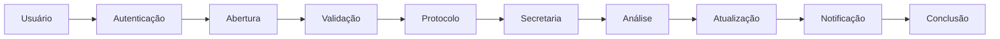
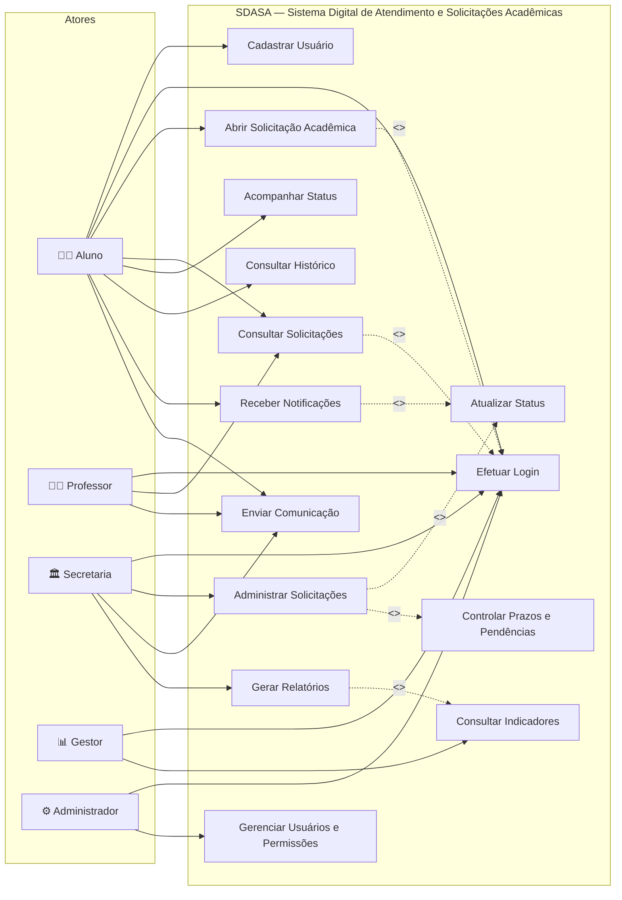
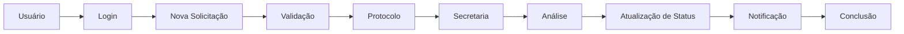
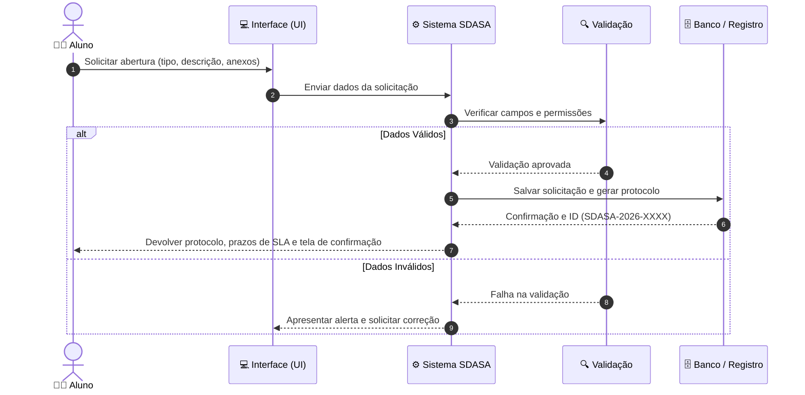

# PARTE II — ENGENHARIA DE SOFTWARE
# ESPECIFICAÇÃO DOS REQUISITOS DO SOFTWARE (SRS)
## SDASA — Sistema Digital de Atendimento e Solicitações Acadêmicas

**Projeto Integrador — Módulo 2**  
**Curso:** Análise e Desenvolvimento de Sistemas  
**Disciplina:** Tópicos Avançados em Sistemas de Informação II  
**Orientação:** Prof.ª Erika Miranda  
**São Paulo — 2026**  

---

## SUMÁRIO — PARTE II

- [1. INTRODUÇÃO](#1-introdução)
  - [1.1 Objetivos deste documento](#11-objetivos-deste-documento)
  - [1.2 Definições e siglas](#12-definições-e-siglas)
  - [1.3 Escopo do produto de software](#13-escopo-do-produto-de-software)
    - [1.3.1 Descrição da oportunidade / problema](#131-descrição-da-oportunidade-a-ser-aproveitada-ou-do-problema-a-ser-resolvido)
    - [1.3.2 Objetivo](#132-objetivo)
    - [1.3.3 Descrição resumida do projeto](#133-descrição-resumida-do-projeto)
    - [1.3.4 Restrições](#134-restrições)
  - [1.4 Nome do produto e componentes principais](#14-nome-do-produto-e-de-seus-componentes-principais)
  - [1.5 Técnicas utilizadas para elicitação de requisitos](#15-técnicas-utilizadas-para-elicitação-de-requisitos)
  - [1.6 Benchmarking](#16-benchmarking)
  - [1.7 Organograma do Departamento](#17-organograma-do-departamento)
- [2. DESCRIÇÃO GERAL DO PRODUTO](#2-descrição-geral-do-produto)
  - [2.1 Usuários e sistemas relacionados](#21-usuários-e-sistemas-relacionados)
    - [2.1.1 Descrição dos atores](#211-descrição)
  - [2.2 Regras de Negócio (RN01 a RN10)](#22-regras-de-negócio)
  - [2.3 Modelagem de Processos de Negócio](#23-modelagem-de-processos-de-negócio)
  - [2.4 Histórias de Usuário (HU01 a HU10)](#24-histórias-de-usuário)
  - [2.5 Requisitos de Software](#25-requisitos-de-software)
    - [Requisitos Funcionais (RF01 a RF12)](#requisitos-funcionais)
    - [Requisitos Não Funcionais (RNF01 a RNF04)](#requisitos-não-funcionais)
    - [Critérios Gerais de Aceitação](#critérios-gerais-de-aceitação)
  - [2.6 Casos de Uso (UC01 a UC06)](#26-casos-de-uso)
  - [2.7 Especificação Detalhada de Casos de Uso](#27-especificação-de-caso-de-uso)
- [3. DIAGRAMAS E RELAÇÃO COM O PROJETO](#3-diagramas-e-relação-com-o-projeto)
  - [3.1 Modelo de Processos](#31-modelo-de-processos)
  - [3.2 Modelo de Casos de Uso](#32-modelo-de-casos-de-uso)
  - [3.3 Sequência do Caso de Uso de Abertura](#33-sequência-do-caso-de-uso-de-abertura)
  - [3.4 Relação com o Protótipo do Módulo 1](#34-relação-com-o-protótipo-do-módulo-1)
  - [3.5 Relação com DevOps](#35-relação-com-devops)
  - [3.6 Rastreabilidade Simplificada](#36-rastreabilidade-simplificada)
  - [3.7 Considerações Finais da Especificação](#37-considerações-finais-da-especificação)
- [4. CONSOLIDAÇÃO DO PROJETO](#4-consolidação-do-projeto)

---

## 1. INTRODUÇÃO

Esta parte do documento apresenta a **Especificação dos Requisitos do Software** do **SDASA — Sistema Digital de Atendimento e Solicitações Acadêmicas**. O conteúdo é uma evolução da proposta definida no Módulo 1 e organiza, de maneira estruturada, o problema, os usuários, as regras de negócio, as histórias de usuário, os requisitos e os casos de uso.

### 1.1 Objetivos deste documento
Documentar os requisitos necessários para orientar o desenvolvimento evolutivo do SDASA, estabelecer uma referência comum para a equipe e partes interessadas e fornecer critérios para análise, desenvolvimento, testes e validação.

### 1.2 Definições e siglas

| Sigla / Termo | Definição |
| :--- | :--- |
| **SDASA** | Sistema Digital de Atendimento e Solicitações Acadêmicas. |
| **RF** | Requisito Funcional. |
| **RNF** | Requisito Não Funcional. |
| **RN** | Regra de Negócio. |
| **HU** | História de Usuário (User Story). |
| **UC** | Caso de Uso (*Use Case*). |
| **CI** | Integração Contínua (*Continuous Integration*). |
| **CD** | Entrega Contínua (*Continuous Delivery*). |
| **SLA** | Acordo ou prazo de nível de serviço para atendimento (*Service Level Agreement*). |

### 1.3 Escopo do produto de software
O SDASA terá como foco centralizar solicitações acadêmicas em um ambiente digital, permitindo que usuários realizem solicitações, acompanhem status, consultem histórico, recebam notificações e mantenham comunicação relacionada às demandas. Para a secretaria, o sistema deverá apoiar organização, encaminhamento, prazos, pendências e acompanhamento.

#### 1.3.1 Descrição da Oportunidade a ser aproveitada ou do Problema a ser resolvido
O problema identificado no Módulo 1 é a ausência de um ambiente único e organizado para realizar, acompanhar e administrar solicitações acadêmicas. A utilização de atendimento presencial e diferentes canais dificulta o acompanhamento, aumenta o tempo de atendimento e gera incerteza sobre prazos e status.

#### 1.3.2 Objetivo
Disponibilizar uma plataforma digital que centralize o atendimento e as solicitações acadêmicas, melhorando a organização das demandas e a transparência do acompanhamento.

#### 1.3.3 Descrição resumida do projeto
O sistema será composto por uma área de acesso do usuário e uma área administrativa. O usuário poderá autenticar-se, abrir solicitações, acompanhar seu status, consultar histórico e receber atualizações. A secretaria poderá visualizar, organizar, encaminhar e atualizar solicitações, controlar prazos e registrar comunicações.

#### 1.3.4 Restrições
- O projeto será desenvolvido de forma evolutiva ao longo dos módulos.
- O acesso e as permissões deverão considerar os diferentes perfis de usuário.
- O protótipo e a primeira versão possuem escopo inicial limitado às funcionalidades prioritárias.
- O desenvolvimento deverá manter rastreabilidade por Git e commits.
- A entrega e as validações deverão considerar a esteira CI/CD prevista no projeto.

### 1.4 Nome do produto e de seus componentes principais
**Produto:** SDASA — Sistema Digital de Atendimento e Solicitações Acadêmicas.

| Componente | Função principal |
| :--- | :--- |
| **Autenticação** | Cadastro e login de usuários. |
| **Portal do usuário** | Abertura e acompanhamento das solicitações. |
| **Módulo de solicitações** | Registro, protocolo, status e histórico. |
| **Notificações** | Comunicação de alterações e conclusões. |
| **Painel da secretaria** | Administração e encaminhamento das demandas. |
| **Controle de prazos** | Acompanhamento de SLA, pendências e vencimentos. |
| **Relatórios** | Indicadores básicos de atendimento. |
| **Infraestrutura DevOps** | Git, testes, CI/CD e publicação. |

### 1.5 Técnicas utilizadas para elicitação de requisitos
As técnicas seguem o trabalho desenvolvido no Módulo 1 e são organizadas para transformar as necessidades identificadas em requisitos verificáveis:

- **Entrevistas:** Foram considerados três perfis: aluno, professor e funcionário da secretaria no Módulo 1.
- **Brainstorming e Ideação:** Foram levantadas alternativas como portal único, painel de status, notificações, histórico, painel administrativo, controle de prazos e comunicação.
- **Observação:** A análise do contexto considera os pontos de dificuldade descritos pelos perfis, principalmente uso de canais diferentes, deslocamento, falta de informação e acompanhamento manual.
- **Benchmarking funcional:** A comparação foi definida por capacidades de sistemas de atendimento e solicitação: abertura de demanda, protocolo, acompanhamento, notificações, gestão administrativa e indicadores. O benchmarking é funcional/conceitual nesta versão, sem atribuir características específicas a produtos externos.

### 1.6 Benchmarking

| Critério | SDASA — proposta |
| :--- | :--- |
| **Abertura de solicitação** | Sim, com tipo, descrição e anexos. |
| **Protocolo** | Sim, gerado no registro da solicitação. |
| **Acompanhamento** | Sim, por status e histórico. |
| **Notificações** | Sim, previstas para alterações. |
| **Gestão administrativa** | Sim, painel para secretaria. |
| **Prazos** | Sim, controle de prazos e pendências. |
| **Comunicação** | Sim, mensagens vinculadas à solicitação. |
| **Indicadores** | Sim, relatórios básicos para gestão. |

### 1.7 Organograma do Departamento
Para fins de modelagem do sistema, a estrutura funcional considerada é:

```
GESTÃO INSTITUCIONAL
       │
       ▼
SECRETARIA / ATENDIMENTO ACADÊMICO
       │
       ▼
PROCESSAMENTO E ACOMPANHAMENTO DAS SOLICITAÇÕES
       │
       ▼
ALUNO / USUÁRIO
```
*Nota: PROFESSORES participam como usuários relacionados ao atendimento e aos processos acadêmicos.*

---

## 2. DESCRIÇÃO GERAL DO PRODUTO

O SDASA será uma solução digital orientada a solicitações acadêmicas. A aplicação deverá apoiar o ciclo completo da demanda: identificação do usuário, abertura, registro de protocolo, tratamento, atualização de status, comunicação, conclusão e consulta histórica.

### 2.1 Usuários e sistemas relacionados

| Usuário / Ator | Descrição | Principais necessidades |
| :--- | :--- | :--- |
| **Aluno** | Usuário principal das solicitações. | Abrir, acompanhar, consultar histórico e receber notificações. |
| **Professor** | Participa de processos acadêmicos e atendimento. | Consultar/acompanhar demandas relacionadas e comunicar informações. |
| **Secretaria** | Responsável pelo processamento das solicitações. | Administrar, encaminhar, atualizar status e controlar prazos. |
| **Gestor** | Acompanha resultados do atendimento. | Consultar indicadores e relatórios. |
| **Administrador** | Responsável por configurações e controle do sistema. | Gerenciar usuários, perfis e parâmetros. |

#### 2.1.1 Descrição
O **aluno** é o ator central do fluxo de solicitação. A **secretaria** atua no processamento e atualização das demandas. **Professores** podem participar de atendimentos ou processos específicos. **Gestores** acompanham indicadores. O **administrador** apoia a configuração e o controle do ambiente.

### 2.2 Regras de Negócio

| ID | Regra de Negócio | Relacionamento |
| :--- | :--- | :--- |
| **RN01** | Toda solicitação deverá possuir um protocolo único. | RF03 |
| **RN02** | Uma solicitação deverá estar vinculada a um usuário autenticado. | RF01 / RF03 |
| **RN03** | O usuário deverá visualizar somente as solicitações às quais possui permissão. | RF02 / RF04 |
| **RN04** | A solicitação deverá possuir um tipo de serviço. | RF03 |
| **RN05** | O sistema deverá registrar data de abertura e histórico de alterações. | RF03 / RF05 |
| **RN06** | O status deverá seguir transições previstas pelo fluxo de atendimento. | RF05 |
| **RN07** | Prazos e pendências deverão ser identificáveis para a secretaria. | RF07 |
| **RN08** | Alterações relevantes poderão gerar notificações ao usuário. | RF06 |
| **RN09** | A comunicação deverá permanecer vinculada à solicitação correspondente. | RF08 |
| **RN10** | Indicadores deverão utilizar dados registrados no sistema. | RF09 |

### 2.3 Modelagem de Processos de Negócio

#### Processo principal: abertura e atendimento de uma solicitação acadêmica
1. Usuário acessa o sistema.
2. Sistema autentica o usuário.
3. Usuário seleciona Nova Solicitação.
4. Usuário informa tipo, descrição e anexos.
5. Sistema valida os dados.
6. Sistema registra a solicitação e gera protocolo.
7. Secretaria recebe a demanda.
8. Secretaria analisa e encaminha/processa.
9. Sistema atualiza o status.
10. Usuário recebe/consulta a atualização.
11. Solicitação é concluída ou devolvida para complementação.



### 2.4 Histórias de Usuário

| ID | História de usuário | Prioridade | Critério principal |
| :--- | :--- | :---: | :--- |
| **HU01** | Como aluno, quero criar uma conta para acessar o sistema. | **Alta** | Cadastro realizado com dados válidos. |
| **HU02** | Como usuário, quero realizar login para acessar minhas solicitações. | **Alta** | Autenticação validada. |
| **HU03** | Como aluno, quero abrir uma solicitação acadêmica. | **Alta** | Solicitação registrada com protocolo. |
| **HU04** | Como aluno, quero acompanhar o status da solicitação. | **Alta** | Status exibido de forma clara. |
| **HU05** | Como aluno, quero consultar meu histórico. | **Média** | Solicitações anteriores disponíveis. |
| **HU06** | Como usuário, quero receber notificações sobre alterações. | **Média** | Atualizações comunicadas ao usuário. |
| **HU07** | Como secretaria, quero administrar as solicitações. | **Alta** | Demandas organizadas para atendimento. |
| **HU08** | Como secretaria, quero controlar prazos e pendências. | **Alta** | Prazos e pendências identificáveis. |
| **HU09** | Como instituição, quero manter comunicação com o usuário. | **Média** | Mensagens vinculadas à solicitação. |
| **HU10** | Como gestor, quero visualizar indicadores de atendimento. | **Baixa** | Relatórios básicos disponíveis. |

### 2.5 Requisitos de Software

#### Requisitos Funcionais

| ID | Nome | Descrição |
| :--- | :--- | :--- |
| **RF01** | Cadastro e autenticação | O sistema deve permitir cadastro e autenticação de usuários. |
| **RF02** | Controle de acesso | O sistema deve controlar acesso conforme perfil e permissões. |
| **RF03** | Abertura de solicitação | O sistema deve permitir registrar uma nova solicitação com tipo, descrição e anexos. |
| **RF04** | Consulta de solicitações | O usuário deve poder consultar suas solicitações. |
| **RF05** | Status e histórico | O sistema deve registrar e apresentar status e histórico de alterações. |
| **RF06** | Notificações | O sistema deve comunicar alterações relevantes ao usuário. |
| **RF07** | Prazos e pendências | O sistema deve permitir à secretaria identificar prazos e pendências. |
| **RF08** | Comunicação | O sistema deve permitir mensagens vinculadas à solicitação. |
| **RF09** | Relatórios e indicadores | O sistema deve apresentar indicadores básicos de atendimento. |
| **RF10** | Administração | O sistema deve permitir gerenciamento administrativo das solicitações. |
| **RF11** | Protocolo | O sistema deve gerar identificador/protocolo para cada solicitação. |
| **RF12** | Consulta de serviços | O sistema deve apresentar os tipos de atendimento disponíveis. |

#### Requisitos Não Funcionais

| ID | Categoria | Descrição |
| :--- | :--- | :--- |
| **RNF01** | Usabilidade | As telas devem apresentar textos e ações claros para o fluxo principal. |
| **RNF02** | Segurança | Dados e funções devem respeitar autenticação, autorização e proteção de informações. |
| **RNF03** | Disponibilidade | A aplicação publicada deve ser monitorada para identificação de indisponibilidade. |
| **RNF04** | Manutenibilidade | O código deve ser versionado, testado e organizado para permitir evolução contínua. |

#### Critérios gerais de aceitação
- A solicitação deve gerar protocolo após validação.
- O usuário deve conseguir identificar o status atual.
- A secretaria deve conseguir localizar e atualizar demandas autorizadas.
- As transições de status devem respeitar o fluxo definido.
- Os testes automatizados devem executar sem falhas antes da publicação.
- Alterações relevantes devem permanecer rastreáveis no histórico do Git.

### 2.6 Casos de Uso

| ID | Caso de uso | Ator principal |
| :--- | :--- | :--- |
| **UC01** | Autenticar usuário | Aluno / Professor / Secretaria |
| **UC02** | Abrir solicitação acadêmica | Aluno |
| **UC03** | Acompanhar solicitação | Aluno |
| **UC04** | Administrar solicitação | Secretaria |
| **UC05** | Enviar/consultar comunicação | Usuário / Secretaria |
| **UC06** | Consultar indicadores | Gestor |

### 2.7 Especificação de Caso de Uso

#### Diagrama de Casos de Uso UML (Conforme Seção 2.7 do Documento Oficial)



---

#### 🔹 UC01 — Autenticar usuário
- **Ator principal:** Usuário cadastrado.
- **Pré-condição:** Usuário possuir cadastro válido.
- **Fluxo principal:**
  1. Acessar tela de login.
  2. Informar credenciais (e-mail institucional ou CPF e senha).
  3. Sistema validar dados de autenticação.
  4. Sistema identificar o perfil do usuário (aluno, professor, secretaria, gestor ou admin).
  5. Sistema apresentar o ambiente correspondente.
- **Fluxos alternativos:** Credenciais inválidas $\rightarrow$ informar erro amigável e solicitar nova tentativa.
- **Pós-condição:** Usuário autenticado com sessão ativa no ambiente correspondente.

#### 🔹 UC02 — Abrir solicitação acadêmica
- **Ator principal:** Aluno.
- **Pré-condição:** Usuário autenticado.
- **Fluxo principal:**
  1. Selecionar "Nova Solicitação".
  2. Escolher o tipo de serviço acadêmico no catálogo.
  3. Preencher a descrição detalhada do pedido.
  4. Anexar arquivos comprobatórios quando necessário.
  5. Enviar formulário de solicitação.
  6. Sistema validar consistência dos dados preenchidos.
  7. Sistema registrar a demanda no banco de dados e gerar protocolo único (`SDASA-2026-XXXX`).
  8. Sistema apresentar tela de confirmação com dados de SLA e prazo estimado.
- **Fluxos alternativos:**
  - *Dados incompletos* $\rightarrow$ solicitar correção dos campos destacados.
  - *Falha no envio* $\rightarrow$ informar erro e permitir nova tentativa sem perda de dados.
- **Pós-condição:** Solicitação registrada no sistema com protocolo formal emitido.

#### 🔹 UC03 — Acompanhar solicitação
- **Ator principal:** Aluno.
- **Pré-condição:** Existir solicitação vinculada ao usuário logado.
- **Fluxo principal:**
  1. Acessar "Minhas Solicitações" no painel principal.
  2. Selecionar a demanda desejada.
  3. Sistema exibir protocolo, status corrente, linha do tempo (histórico) e informações de prazo/SLA.
  4. Usuário consultar os detalhes e emitir comprovante se desejar.
- **Pós-condição:** Usuário obtém informação atualizada e transparente sobre sua demanda.

#### 🔹 UC04 — Administrar solicitação
- **Ator principal:** Secretaria.
- **Pré-condição:** Usuário possuir permissão administrativa.
- **Fluxo principal:**
  1. Acessar o painel administrativo da secretaria.
  2. Localizar a solicitação por filtros de status, tipo ou protocolo.
  3. Analisar dados e documentos anexados.
  4. Encaminhar/processar a demanda.
  5. Atualizar status (Aguardando Triagem, Em Análise, Concluído/Deferido, Indeferido).
  6. Registrar comunicação ou parecer formal quando necessário.
  7. Concluir a solicitação ou devolver para complementação de documentos.
- **Pós-condição:** Solicitação atualizada, parecer registrado e histórico gravado.

#### 🔹 UC05 — Comunicação vinculada
- **Atores:** Usuário (aluno/docente) e Secretaria.
- **Pré-condição:** Solicitação existente no sistema.
- **Fluxo:**
  1. Selecionar uma solicitação no painel.
  2. Visualizar histórico de mensagens vinculadas ao protocolo.
  3. Escrever nova mensagem com orientações ou esclarecimentos.
  4. Enviar mensagem.
  5. Sistema vincula a mensagem ao número do protocolo.
  6. Destinatário recebe notificação e consulta o histórico atualizado.

#### 🔹 UC06 — Consultar indicadores
- **Ator principal:** Gestor.
- **Pré-condição:** Perfil de Gestão ativo.
- **Fluxo:**
  1. Acessar o painel gerencial.
  2. Selecionar período ou indicador de interesse (tempo médio, taxa de cumprimento de SLA, tipos mais recorrentes).
  3. Sistema consolidar e tabular dados registrados.
  4. Apresentar relatórios básicos e gráficos sintéticos de atendimento.

---

## 3. DIAGRAMAS E RELAÇÃO COM O PROJETO

Os diagramas abaixo representam, em nível conceitual e arquitetural, os principais elementos da solução.

### 3.1 Modelo de processos



### 3.2 Modelo de casos de uso
- **Aluno:** Autenticar, Abrir solicitação, Acompanhar solicitação, Consultar histórico, Receber/Enviar comunicação.
- **Professor:** Autenticar, Consultar/participar de solicitações autorizadas, Comunicação.
- **Secretaria:** Autenticar, Administrar solicitação, Atualizar status, Controlar prazos, Comunicação.
- **Gestor:** Autenticar, Consultar indicadores.
- **Administrador:** Gerenciar usuários, perfis e parâmetros.

### 3.3 Sequência do caso de uso de abertura



### 3.4 Relação com o protótipo do Módulo 1
A especificação mantém o fluxo definido no Design Thinking: **Tela inicial $\rightarrow$ Login $\rightarrow$ Tela principal $\rightarrow$ Nova solicitação $\rightarrow$ Confirmação**. Os requisitos detalham as funções necessárias para transformar esse fluxo em produto de software.

### 3.5 Relação com DevOps
A implementação dos requisitos segue o processo DevOps definido no Módulo 1:
$$\text{BACKLOG} \rightarrow \text{DESENVOLVIMENTO} \rightarrow \text{GIT/COMMIT} \rightarrow \text{REVISÃO} \rightarrow \text{TESTES} \rightarrow \text{INTEGRAÇÃO CONTÍNUA} \rightarrow \text{VERIFICAÇÃO DE SEGURANÇA} \rightarrow \text{ENTREGA/PUBLICAÇÃO} \rightarrow \text{MONITORAMENTO} \rightarrow \text{FEEDBACK}$$

### 3.6 Rastreabilidade simplificada

| Necessidade | História | Requisito | Caso de Uso |
| :--- | :---: | :---: | :---: |
| **Acessar o sistema** | HU01 / HU02 | RF01 / RF02 | UC01 |
| **Registrar demanda** | HU03 | RF03 / RF11 / RF12 | UC02 |
| **Acompanhar andamento** | HU04 / HU05 | RF04 / RF05 | UC03 |
| **Administrar demandas** | HU07 / HU08 | RF07 / RF10 | UC04 |
| **Comunicar usuário** | HU06 / HU09 | RF06 / RF08 | UC05 |
| **Indicadores** | HU10 | RF09 | UC06 |

### 3.7 Considerações finais da especificação
A especificação organiza as necessidades identificadas no Módulo 1 em uma base técnica para continuidade do projeto. Os requisitos deverão ser revisados e refinados nos módulos seguintes conforme a evolução da solução, prototipação, arquitetura, implementação, testes e validação com usuários.

---

## 4. CONSOLIDAÇÃO DO PROJETO

O **SDASA** mantém uma linha de evolução coerente desde a identificação do problema até a proposta técnica:
1. O **Módulo 1** identifica as dificuldades de alunos, professores e secretaria.
2. O **Design Thinking** transforma essas necessidades em uma proposta centrada no usuário.
3. O **DevOps** define como a solução será desenvolvida e entregue continuamente.
4. A **Engenharia de Software (Parte II)** organiza os requisitos necessários para orientar a implementação.
